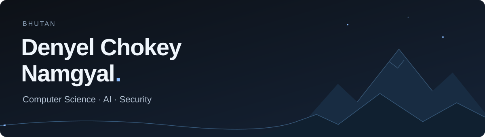

[LinkedIn](https://www.linkedin.com/in/denyelchokeynamgyal) · [Repositories](https://github.com/denyelcnamgyal42-hash?tab=repositories)

I'm Denyel, a Computer Science student at **Gyalpozhing College of Information Technology** in Bhutan. I specialize in AI & Data Science, and I'm also learning about cybersecurity.

I like figuring out how things work by building something small and testing it. Lately, that means working with language models, retrieval, and the backend systems around them.

### What I'm learning

- **AI:** building LLM applications, evaluating retrieval, and exploring computer vision.
- **Security:** web security, secure application design, and Linux through hands-on labs.
- **Language technology:** how AI can be useful for low-resource languages.

### Tools I use

Python, PyTorch, FastAPI, Docker, Linux, and Git.

A few more from my workbench

| Area | Tools |
| :--- | :--- |
| Data & ML | Pandas, NumPy, Scikit-learn, TensorFlow, OpenCV, YOLO |
| LLM applications | LangChain, FAISS, Chroma, Ollama, Groq |
| Backend & databases | Flask, Node.js / Express, PostgreSQL, MySQL, MongoDB |
| Security labs | Nmap, Burp Suite, OWASP ZAP, Kali Linux |

### Outside of code

I follow football and aerospace. Over time, I'd like to use what I learn to build useful technology and help improve digital security in Bhutan.

My contributions, with a snake

  <picture>
    <source media="(prefers-color-scheme: dark)" srcset="https://raw.githubusercontent.com/denyelcnamgyal42-hash/denyelcnamgyal42-hash/output/github-contribution-grid-snake-dark.svg" />
    <source media="(prefers-color-scheme: light)" srcset="https://raw.githubusercontent.com/denyelcnamgyal42-hash/denyelcnamgyal42-hash/output/github-contribution-grid-snake.svg" />
    
  </picture>

