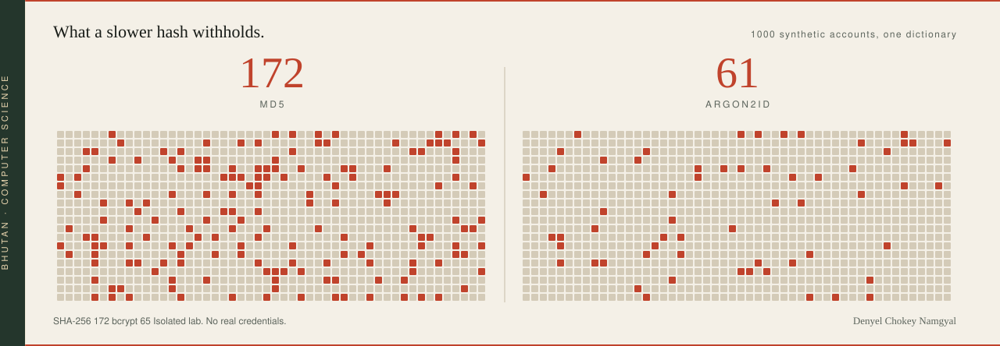

<a href="https://github.com/denyelcnamgyal42-hash/password-security-research-lab">
  <picture>
    <source media="(prefers-color-scheme: dark)" srcset="./assets/plate-dark.svg">
    
  </picture>
</a>

I study how intelligent systems work, and how to keep them honest.

Computer Science student in Bhutan. I work where artificial intelligence, cybersecurity, and software engineering meet.

**[Password Security Research Lab](https://github.com/denyelcnamgyal42-hash/password-security-research-lab)**  
Hashing under dictionary attack. The figure is the measured result.

**SentinelAI**  
AI-assisted vulnerability assessment for authorized web application testing. In progress.

**Until Then**  
A digital time capsule. Shared memories stay sealed until a date you choose.

**[RL Snake](https://github.com/denyelcnamgyal42-hash/snake_game_reinforcement_learning)**  
A reinforcement-learning agent in a game I can watch.

Now: LLMs, RAG, secure applications, cloud, and system design.

  
  

