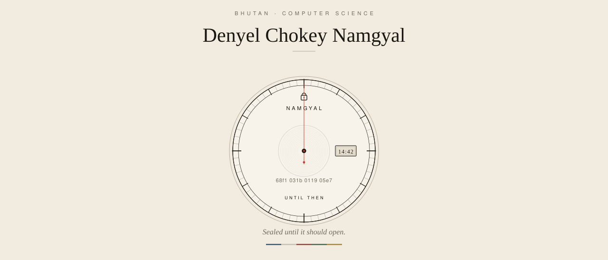

<picture>
  <source media="(prefers-color-scheme: dark)" srcset="./assets/dial-dark.svg">
  
</picture>

## About

I'm **Denyel Chokey Namgyal**, a Computer Science student in Bhutan.

I learn by building things I can actually run, measure, and explain. Most of my work sits where **artificial intelligence**, **cybersecurity**, and **software engineering** meet: systems that do something useful, and that you can still trust when they do.

I care about two questions. How do intelligent systems work? And how do you keep them from being easy to abuse? That is why a password-hashing study, an authorized security tool, a sealed time capsule, and a small reinforcement-learning agent all live on the same page.

## Projects

The four smaller dials on the clock are the work.

- **[Password Security Lab](https://github.com/denyelcnamgyal42-hash/password-security-research-lab)** (top) -- I compared hashing algorithms under a dictionary attack on 1,000 fake accounts. Fast hashes (MD5) gave up 172 passwords. Argon2id gave up 61. No real credentials. Isolated lab only.
- **SentinelAI** (right) -- An AI-assisted tool for authorized web application testing. Still in progress. The goal is a report a person can stand behind, not a dump of scanner noise.
- **Until Then** (bottom) -- A digital time capsule. Shared memories stay locked until a date the people who made them chose.
- **[RL Snake](https://github.com/denyelcnamgyal42-hash/snake_game_reinforcement_learning)** (left) -- A reinforcement-learning agent that learns to play Snake. A small board where I can watch an agent fail, then improve.

Right now I am studying large language models, retrieval-augmented generation, secure application development, cloud, and system design.

  
  

