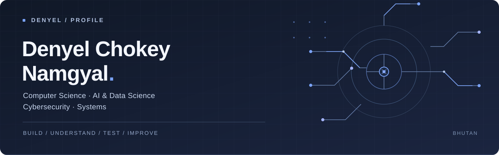

  

  <a href="https://www.linkedin.com/in/denyelchokeynamgyal">LinkedIn</a>
  &nbsp; / &nbsp;
  <a href="https://github.com/denyelcnamgyal42-hash?tab=repositories">Explore my repositories</a>
  &nbsp; / &nbsp;
  <a href="#currently-exploring">What I'm learning</a>

 

### A little context

I'm **Denyel**, a Computer Science student at **Gyalpozhing College of Information Technology, Bhutan**, specializing in **AI & Data Science** and developing my skills in **Cybersecurity**.

I like taking an idea apart, building a small version, and understanding why it works. I'm especially interested in the overlap between intelligent systems and secure software—and language technology that makes digital services more accessible in Bhutan.

 

### Currently exploring

| | Focus | Questions I'm working through |
| :--- | :--- | :--- |
| **01** | **Applied AI** | How can machine learning and computer vision solve useful, everyday problems? |
| **02** | **Language & retrieval** | How do we build and evaluate LLM applications with better context? |
| **03** | **Secure systems** | How can I build applications that are easier to understand, maintain, and secure? |

 

### My workbench

`Python` &nbsp; `JavaScript` &nbsp; `SQL` &nbsp; `PyTorch` &nbsp; `FastAPI` &nbsp; `Linux` &nbsp; `Docker` &nbsp; `Git`

More tools I work with

 

| Area | Tools |
| :--- | :--- |
| Machine learning | TensorFlow, Scikit-learn, Pandas, NumPy, OpenCV, YOLO |
| LLM applications | LangChain, RAG, FAISS, Chroma, Ollama, Groq |
| Backend & data | Flask, Node.js / Express, PostgreSQL, MySQL, MongoDB |
| Security labs | Kali Linux, Nmap, Burp Suite, OWASP ZAP |

I explore security tools in authorized labs while learning secure development.

 

### Away from the keyboard

Football, aerospace, and small, consistent improvements. Long term, I want to contribute to practical technology and digital security in Bhutan.

 

---

  Built on curiosity. Improved through practice.

