  <picture>
  <source media="(max-width: 600px)" srcset="./assets/banner-mobile.svg" />
  
  </picture>

  <a href="https://www.linkedin.com/in/denyelchokeynamgyal">LinkedIn</a>
  &nbsp; / &nbsp;
  <a href="#selected-work">Selected work</a>
  &nbsp; / &nbsp;
  <a href="https://github.com/denyelcnamgyal42-hash?tab=repositories">All repositories</a>

 

### Hi, I'm Denyel.

I'm a Computer Science student at **Gyalpozhing College of Information Technology, Bhutan**, specializing in **AI & Data Science** and developing my skills in **Cybersecurity**.

I learn by building: an agent that plays Snake, a conversational booking assistant, and experiments in password security. I'm interested in intelligent systems, secure software, and language technology that makes digital services more accessible in Bhutan.

 

### Selected work

#### 01 / Learning through play

**[Snake · Reinforcement Learning](https://github.com/denyelcnamgyal42-hash/snake_game_reinforcement_learning)**

A Snake-playing agent with a PyTorch Q-network, experience replay, and a training loop. An exploration of how actions, rewards, and repeated experience shape behavior.

`Python` `PyTorch` `Reinforcement learning`

#### 02 / From conversation to action

**[WhatsApp Booking Assistant](https://github.com/denyelcnamgyal42-hash/final123_bot)**

A conversational room-booking project with LangChain tools, a Flask webhook, availability checks, and a booking approval workflow.

`Python` `LangChain` `Flask` `WhatsApp`

#### 03 / Security through experimentation

**[Password Security Research Lab](https://github.com/denyelcnamgyal42-hash/password-security-research-lab)**

A controlled comparison of MD5, SHA-256, bcrypt, and Argon2id using synthetic accounts. Explores password recovery, hashing costs, and defensive storage practices.

`Python` `Password hashing` `Security research`

 

### Currently exploring

  

**Next questions:** better retrieval and evaluation for LLM applications, secure application design, and the Linux and cloud fundamentals underneath them.

 

### My workbench

`Python` &nbsp; `JavaScript` &nbsp; `SQL` &nbsp; `PyTorch` &nbsp; `FastAPI` &nbsp; `Linux` &nbsp; `Docker` &nbsp; `Git`

More tools I work with

 

| Area | Tools |
| :--- | :--- |
| Machine learning | TensorFlow, Scikit-learn, Pandas, NumPy, OpenCV, YOLO |
| LLM applications | LangChain, RAG, FAISS, Chroma, Ollama, Groq |
| Backend & data | Flask, Node.js / Express, PostgreSQL, MySQL, MongoDB |
| Security labs | Kali Linux, Nmap, Burp Suite, OWASP ZAP |

I explore security tools in authorized labs while learning secure development.

 

### Away from the keyboard

Football, aerospace, and small, consistent improvements. Long term, I want to contribute to practical technology and digital security in Bhutan.

 

### One contribution at a time

<picture>
  <source media="(prefers-color-scheme: dark)" srcset="https://raw.githubusercontent.com/denyelcnamgyal42-hash/denyelcnamgyal42-hash/output/github-contribution-grid-snake-dark.svg" />
  <source media="(prefers-color-scheme: light)" srcset="https://raw.githubusercontent.com/denyelcnamgyal42-hash/denyelcnamgyal42-hash/output/github-contribution-grid-snake.svg" />
  
</picture>

A little progress, repeated. Contribution animation refreshed daily.

 

---

  <b>Let's talk about something worth building.</b> 
  <a href="https://www.linkedin.com/in/denyelchokeynamgyal">Connect on LinkedIn</a>
    
  From Bhutan, with curiosity.

